# Building Model v2 — UML Class Diagram

**Date:** 2026-06-26  
**Status:** Pending Approval  

---

## Class Diagram

```mermaid
classDiagram
    direction TB

    class Project {
        +id: str
        +name: str
        +description: str
        +created_at: str
        +updated_at: str
        +buildings: tuple~Building~~
        +metadata: dict~str, Any~
        +to_dict() dict~str, Any~
        +from_dict(payload) Project
    }

    class Building {
        +id: str
        +name: str
        +building_type: str | None
        +address: str | None
        +year_built: int | None
        +floors: tuple~Floor~~
        +metadata: dict~str, Any~
        +total_area: float
        +built_up_area: float
        +number_of_rooms: int
        +number_of_walls: int
        +number_of_doors: int
        +number_of_windows: int
        +number_of_floors: int
        +number_of_columns: int
        +number_of_stairs: int
        +bounding_box: BoundingBox | None
        +building_orientation: Orientation
        +get_floor_by_id(id) Floor | None
        +get_room_by_id(id) Room | None
        +get_adjacent_rooms(id) tuple~Room~~
        +to_dict() dict~str, Any~
    }

    class Floor {
        +id: str
        +name: str
        +level: float
        +height: float
        +floor_type: FloorType
        +rooms: tuple~Room~~
        +walls: tuple~Wall~~
        +doors: tuple~Door~~
        +windows: tuple~Window~~
        +columns: tuple~Column~~
        +stairs: tuple~Stair~~
        +metadata: dict~str, Any~
        +total_area: float
        +room_count: int
        +wall_count: int
        +door_count: int
        +window_count: int
        +bounding_box: BoundingBox | None
        +to_dict() dict~str, Any~
    }

    class Room {
        +id: str
        +name: str
        +room_type: RoomType
        +floor_id: str
        +polygon: Polygon
        +height: float | None
        +label_text: str | None
        +label_position: Point2D | None
        +metadata: dict~str, Any~
        +area: float
        +perimeter: float
        +centroid: Point2D
        +orientation_degrees: float
        +bounding_box: BoundingBox
        +is_convex: bool
        +solidity: float
        +convex_hull_area: float
        +to_dict() dict~str, Any~
    }

    class Wall {
        +id: str
        +wall_type: WallType
        +geometry: LineString
        +width: float
        +height: float | None
        +polygon: Polygon | None
        +room_ids: frozenset~str~
        +floor_id: str | None
        +metadata: dict~str, Any~
        +length: float
        +bounding_box: BoundingBox
        +orientation_degrees: float
        +to_dict() dict~str, Any~
    }

    class Opening {
        <<abstract>>
        +id: str
        +opening_type: OpeningType
        +geometry: Point | LineString
        +width: float
        +height: float | None
        +room_ids: frozenset~str~
        +wall_id: str | None
        +floor_id: str | None
        +metadata: dict~str, Any~
        +location: Point2D
        +to_dict() dict~str, Any~
    }

    class Door {
        +id: str
        +door_type: DoorType
        +is_exterior: bool
        +swing_direction: str | None
        +opening_type: OpeningType.DOOR
        +to_dict() dict~str, Any~
    }

    class Window {
        +id: str
        +window_type: WindowType
        +sill_height: float | None
        +is_exterior: bool
        +opening_type: OpeningType.WINDOW
        +to_dict() dict~str, Any~
    }

    class Column {
        +id: str
        +column_type: ColumnType
        +geometry: Point | Polygon
        +width: float
        +height: float
        +floor_id: str | None
        +metadata: dict~str, Any~
        +location: Point2D
        +bounding_box: BoundingBox
        +to_dict() dict~str, Any~
    }

    class Stair {
        +id: str
        +stair_type: StairType
        +geometry: Polygon
        +width: float
        +floor_ids: frozenset~str~
        +direction: str | None
        +floor_id: str | None
        +metadata: dict~str, Any~
        +area: float
        +bounding_box: BoundingBox
        +orientation_degrees: float
        +to_dict() dict~str, Any~
    }

    class AnalysisResult {
        +id: str
        +building_id: str
        +analysis_type: str
        +timestamp: str
        +adjacency_graph: tuple~AdjacencyRelation~~
        +connectivity_graph: tuple~ConnectivityRelation~~
        +facing_information: FacingInfo | None
        +zoning: tuple~ZoningResult~~
        +confidence: tuple~ConfidenceScore~~
        +vastu_analysis: VastuResult | None
        +metadata: dict~str, Any~
        +to_dict() dict~str, Any~
    }

    class AdjacencyRelation {
        +room_id: str
        +adjacent_room_ids: tuple~str~~
        +shared_boundary_length: float
        +to_dict() dict~str, Any~
    }

    class ConnectivityRelation {
        +room_id: str
        +connected_rooms: tuple~ConnectedRoom~~
        +to_dict() dict~str, Any~
    }

    class ConnectedRoom {
        +room_id: str
        +door_id: str
        +to_dict() dict~str, Any~
    }

    class FacingInfo {
        +road_side: Orientation
        +front_wall_id: str | None
        +front_rooms: tuple~str~~
        +to_dict() dict~str, Any~
    }

    class ZoningResult {
        +room_id: str
        +zone: str
        +zone_category: str
        +compliance: bool
        +to_dict() dict~str, Any~
    }

    class ConfidenceScore {
        +room_id: str
        +score: float
        +factors: dict~str, float~
        +to_dict() dict~str, Any~
    }

    class VastuResult {
        +room_id: str
        +direction: Orientation
        +compliance_score: float
        +recommendations: tuple~str~~
        +to_dict() dict~str, Any~
    }

    class BoundingBox {
        +min_x: float
        +min_y: float
        +max_x: float
        +max_y: float
        +width: float
        +height: float
        +area: float
        +center: Point2D
        +to_shapely() Polygon
        +to_dict() dict~str, float~
        +from_points(points) BoundingBox
        +from_polygon(polygon) BoundingBox
    }

    class Point2D {
        +x: float
        +y: float
        +to_array() ndarray
        +to_dict() dict~str, float~
    }

    class GeometryMixin {
        <<mixin>>
        +polygon: Polygon
        +bounding_box: BoundingBox
        +area: float
        +perimeter: float
        +centroid: Point2D
        +orientation_degrees: float
        +is_convex: bool
        +solidity: float
        +convex_hull_area: float
    }

    class BuildingStatistics {
        +room_count: int
        +wall_count: int
        +door_count: int
        +window_count: int
        +column_count: int
        +stair_count: int
        +total_area: float
        +built_up_area: float
        +average_room_area: float
        +total_room_perimeter: float
        +adjacency_edge_count: int
        +connectivity_edge_count: int
        +front_room_count: int
        +average_confidence: float
        +zones: dict~str, int~
        +to_dict() dict~str, Any~
    }

    class ValidationIssue {
        +code: str
        +message: str
        +severity: str
        +to_dict() dict~str, str~
    }

    class ValidationReport {
        +valid: bool
        +issues: tuple~ValidationIssue~~
        +to_dict() dict~str, Any~
    }

    %% Enumerations
    class RoomType {
        <<enumeration>>
        LIVING
        BEDROOM
        KITCHEN
        DINING
        TOILET
        BATHROOM
        STORAGE
        CORRIDOR
        STAIRCASE
        BALCONY
        UTILITY
        UNKNOWN
    }

    class WallType {
        <<enumeration>>
        EXTERIOR
        INTERIOR
        PARTITION
        BEARING
        SHEAR
        UNKNOWN
    }

    class OpeningType {
        <<enumeration>>
        DOOR
        WINDOW
        VENTILATION
        ARCHWAY
        SLIDING_DOOR
        FRENCH_DOOR
        UNKNOWN
    }

    class DoorType {
        <<enumeration>>
        SINGLE_LEAF
        DOUBLE_LEAF
        SLIDING
        FOLDING
        REVOLVING
        UNKNOWN
    }

    class WindowType {
        <<enumeration>>
        FIXED
        CASEMENT
        SLIDING
        AWNING
        BAY
        UNKNOWN
    }

    class ColumnType {
        <<enumeration>>
        RECTANGULAR
        CIRCULAR
        SQUARE
        STRUCTURAL
        UNKNOWN
    }

    class StairType {
        <<enumeration>>
        STRAIGHT
        L_SHAPED
        U_SHAPED
        SPIRAL
        CURVED
        UNKNOWN
    }

    class FloorType {
        <<enumeration>>
        GROUND
        BASEMENT
        UPPER
        ROOF
        MEZZANINE
        UNKNOWN
    }

    class Orientation {
        <<enumeration>>
        NORTH
        NORTHEAST
        EAST
        SOUTHEAST
        SOUTH
        SOUTHWEST
        WEST
        NORTHWEST
        CENTER
        UNKNOWN
    }

    %% Relationships
    Project "1" *-- "0..*" Building : contains
    Building "1" *-- "1..*" Floor : contains
    Floor "1" *-- "0..*" Room : contains
    Floor "1" *-- "0..*" Wall : contains
    Floor "1" *-- "0..*" Door : contains
    Floor "1" *-- "0..*" Window : contains
    Floor "1" *-- "0..*" Column : contains
    Floor "1" *-- "0..*" Stair : contains

    Room "0..*" --> "1" Floor : belongs_to
    Room "0..*" --> "0..*" Wall : adjacent_to
    Room "0..*" --> "0..*" Door : accessible_via
    Room "0..*" --> "0..*" Window : has_opening

    Wall "0..*" --> "1" Floor : belongs_to
    Wall "0..*" --> "0..*" Room : borders
    Wall "0..*" --> "0..*" Opening : contains

    Door "0..*" --> "1" Opening : extends
    Window "0..*" --> "1" Opening : extends
    Opening "0..*" --> "0..1" Wall : belongs_to
    Opening "0..*" --> "0..*" Room : connects

    Column "0..*" --> "0..1" Floor : belongs_to
    Stair "0..*" --> "0..*" Floor : connects

    Building "1" --> "1" BuildingStatistics : has
    Building "1" --> "0..1" AnalysisResult : analyzed_by
    Building "1" --> "1" BoundingBox : bounded_by

    AnalysisResult "0..*" --> "1" Building : analyzes
    AnalysisResult "1" --> "0..*" AdjacencyRelation : contains
    AnalysisResult "1" --> "0..*" ConnectivityRelation : contains
    AnalysisResult "1" --> "0..1" FacingInfo : contains
    AnalysisResult "1" --> "0..*" ZoningResult : contains
    AnalysisResult "1" --> "0..*" ConfidenceScore : contains
    AnalysisResult "1" --> "0..1" VastuResult : contains

    Room "1" --> "1" BoundingBox : bounded_by
    Wall "1" --> "1" BoundingBox : bounded_by
    Door "1" --> "1" Point2D : located_at
    Window "1" --> "1" Point2D : located_at
    Column "1" --> "1" BoundingBox : bounded_by
    Stair "1" --> "1" BoundingBox : bounded_by

    Room --|> GeometryMixin : uses
    Wall ..> BoundingBox : computes
    Door ..> Point2D : computes
    Window ..> Point2D : computes
    Column ..> BoundingBox : computes
    Stair ..> BoundingBox : computes
```

---

## Relationship Summary

### Composition (Strong Ownership)

| Parent | Child | Cardinality | Description |
|--------|-------|-------------|-------------|
| Project | Building | 1..* | Project contains buildings |
| Building | Floor | 1..* | Building contains floors |
| Floor | Room | 0..* | Floor contains rooms |
| Floor | Wall | 0..* | Floor contains walls |
| Floor | Door | 0..* | Floor contains doors |
| Floor | Window | 0..* | Floor contains windows |
| Floor | Column | 0..* | Floor contains columns |
| Floor | Stair | 0..* | Floor contains stairs |
| Opening | Door | 1 | Door extends Opening |
| Opening | Window | 1 | Window extends Opening |

### Association (Weak Reference)

| From | To | Cardinality | Description |
|------|----|-------------|-------------|
| Room | Floor | 1 | Room belongs to floor |
| Room | Wall | 0..* | Room adjacent to walls |
| Room | Door | 0..* | Room accessible via doors |
| Room | Window | 0..* | Room has window openings |
| Wall | Floor | 1 | Wall belongs to floor |
| Wall | Room | 0..* | Wall borders rooms |
| Wall | Opening | 0..* | Wall contains openings |
| Opening | Wall | 0..1 | Opening belongs to wall |
| Opening | Room | 0..* | Opening connects rooms |
| Column | Floor | 0..1 | Column belongs to floor |
| Stair | Floor | 0..* | Stair connects floors |

### Usage (Dependencies)

| From | To | Description |
|------|----|-------------|
| Room | GeometryMixin | Uses geometry properties |
| Wall | BoundingBox | Computes bounding box |
| Door | Point2D | Computes location |
| Window | Point2D | Computes location |
| Column | BoundingBox | Computes bounding box |
| Stair | BoundingBox | Computes bounding box |

---

## Entity Count

| Category | Count |
|----------|-------|
| Core Entities | 8 (Building, Floor, Room, Wall, Door, Window, Column, Stair) |
| Analysis Entities | 6 (AnalysisResult, AdjacencyRelation, ConnectivityRelation, FacingInfo, ZoningResult, ConfidenceScore) |
| Support Entities | 4 (BoundingBox, Point2D, GeometryMixin, ValidationIssue) |
| Enumerations | 8 (RoomType, WallType, OpeningType, DoorType, WindowType, ColumnType, StairType, FloorType, Orientation) |
| **Total Classes** | **26** |

---

**Document Version:** 1.0.0  
**Last Updated:** 2026-06-26