# Building Model v2 — UML Class Diagram

**Date:** 2026-06-26  
**Status:** Pending Approval  

---

## Class Diagram

```mermaid
classDiagram
    direction TB

    %% ==================== BASE ENTITY ====================
    class BaseEntity {
        <<abstract>>
        +id: str
        +created_at: str
        +updated_at: str
        +metadata: dict~str, Any~
        +to_dict() dict~str, Any~
        +from_dict(payload) BaseEntity
    }

    %% ==================== GEOMETRY ====================
    class BoundingBox {
        +min_x: float
        +min_y: float
        +max_x: float
        +max_y: float
        +width: float
        +height: float
        +area: float
        +center: Point2D
        +to_shapely() Polygon
        +to_dict() dict~str, float~
        +from_points(points) BoundingBox
        +from_polygon(polygon) BoundingBox
    }

    class Point2D {
        +x: float
        +y: float
        +to_array() ndarray
        +to_dict() dict~str, float~
    }

    class GeometryMixin {
        <<mixin>>
        +polygon: Polygon
        +bounding_box: BoundingBox
        +area: float
        +perimeter: float
        +centroid: Point2D
        +orientation_degrees: float
        +is_convex: bool
        +solidity: float
    }

    %% ==================== PROJECT ====================
    class Project {
        +id: str
        +name: str
        +description: str
        +buildings: tuple~Building~~
        +created_at: str
        +updated_at: str
        +metadata: dict~str, Any~
        +total_area: float
        +building_count: int
        +to_dict() dict~str, Any~
        +from_dict(payload) Project
    }

    %% ==================== BUILDING ====================
    class Building {
        +id: str
        +name: str
        +building_type: str | None
        +address: str | None
        +year_built: int | None
        +floors: tuple~Floor~~
        +metadata: dict~str, Any~
        +total_area: float
        +built_up_area: float
        +number_of_floors: int
        +number_of_rooms: int
        +number_of_walls: int
        +number_of_doors: int
        +number_of_windows: int
        +number_of_columns: int
        +number_of_stairs: int
        +bounding_box: BoundingBox | None
        +building_orientation: Orientation
        +get_floor_by_id(id) Floor | None
        +get_room_by_id(id) Room | None
        +get_adjacent_rooms(id) tuple~Room~~
        +to_dict() dict~str, Any~
        +from_dict(payload) Building
    }

    %% ==================== FLOOR ====================
    class Floor {
        +id: str
        +name: str
        +level: float
        +height: float
        +floor_type: FloorType
        +rooms: tuple~Room~~
        +walls: tuple~Wall~~
        +doors: tuple~Door~~
        +windows: tuple~Window~~
        +columns: tuple~Column~~
        +stairs: tuple~Stair~~
        +metadata: dict~str, Any~
        +total_area: float
        +room_count: int
        +wall_count: int
        +door_count: int
        +window_count: int
        +bounding_box: BoundingBox | None
        +to_dict() dict~str, Any~
        +from_dict(payload) Floor
    }

    %% ==================== ROOM ====================
    class Room {
        +id: str
        +name: str
        +room_type: RoomType
        +floor_id: str
        +polygon: Polygon
        +height: float | None
        +label_text: str | None
        +label_position: Point2D | None
        +wall_ids: frozenset~str~
        +door_ids: frozenset~str~
        +window_ids: frozenset~str~
        +metadata: dict~str, Any~
        +area: float
        +perimeter: float
        +centroid: Point2D
        +orientation_degrees: float
        +bounding_box: BoundingBox
        +is_convex: bool
        +solidity: float
        +convex_hull_area: float
        +to_dict() dict~str, Any~
        +from_dict(payload) Room
    }

    %% ==================== WALL ====================
    class Wall {
        +id: str
        +wall_type: WallType
        +geometry: LineString
        +width: float
        +height: float | None
        +polygon: Polygon | None
        +room_ids: frozenset~str~
        +floor_id: str | None
        +door_ids: frozenset~str~
        +window_ids: frozenset~str~
        +metadata: dict~str, Any~
        +length: float
        +bounding_box: BoundingBox
        +orientation_degrees: float
        +to_dict() dict~str, Any~
        +from_dict(payload) Wall
    }

    %% ==================== OPENING (Abstract) ====================
    class Opening {
        <<abstract>>
        +id: str
        +opening_type: OpeningType
        +width: float
        +height: float | None
        +location: Point2D
        +wall_id: str | None
        +room_ids: frozenset~str~
        +floor_id: str | None
        +is_exterior: bool
        +metadata: dict~str, Any~
        +to_dict() dict~str, Any~
        +from_dict(payload) Opening
    }

    %% ==================== DOOR ====================
    class Door {
        +id: str
        +door_type: DoorType
        +swing_direction: str | None
        +opening_type: OpeningType.DOOR
        +geometry: Point | LineString
        +to_dict() dict~str, Any~
        +from_dict(payload) Door
    }

    %% ==================== WINDOW ====================
    class Window {
        +id: str
        +window_type: WindowType
        +sill_height: float | None
        +opening_type: OpeningType.WINDOW
        +geometry: Point | LineString
        +to_dict() dict~str, Any~
        +from_dict(payload) Window
    }

    %% ==================== COLUMN ====================
    class Column {
        +id: str
        +column_type: ColumnType
        +geometry: Point | Polygon
        +width: float
        +height: float
        +floor_id: str | None
        +metadata: dict~str, Any~
        +location: Point2D
        +bounding_box: BoundingBox
        +area: float
        +to_dict() dict~str, Any~
        +from_dict(payload) Column
    }

    %% ==================== STAIR ====================
    class Stair {
        +id: str
        +stair_type: StairType
        +geometry: Polygon
        +width: float
        +floor_ids: frozenset~str~
        +direction: str | None
        +floor_id: str | None
        +metadata: dict~str, Any~
        +area: float
        +bounding_box: BoundingBox
        +orientation_degrees: float
        +to_dict() dict~str, Any~
        +from_dict(payload) Stair
    }

    %% ==================== ANALYSIS ====================
    class AnalysisResult {
        +id: str
        +building_id: str
        +analysis_type: str
        +timestamp: str
        +adjacency_graph: tuple~AdjacencyRelation~~
        +connectivity_graph: tuple~ConnectivityRelation~~
        +facing_information: FacingInfo | None
        +zoning: tuple~ZoningResult~~
        +confidence: tuple~ConfidenceScore~~
        +vastu_analysis: VastuResult | None
        +metadata: dict~str, Any~
        +to_dict() dict~str, Any~
        +from_dict(payload) AnalysisResult
    }

    class AdjacencyRelation {
        +room_id: str
        +adjacent_room_ids: tuple~str~~
        +shared_boundary_length: float
        +to_dict() dict~str, Any~
    }

    class ConnectivityRelation {
        +room_id: str
        +connected_rooms: tuple~ConnectedRoom~~
        +to_dict() dict~str, Any~
    }

    class ConnectedRoom {
        +room_id: str
        +door_id: str
        +to_dict() dict~str, Any~
    }

    class FacingInfo {
        +road_side: Orientation
        +front_wall_id: str | None
        +front_rooms: tuple~str~~
        +to_dict() dict~str, Any~
    }

    class ZoningResult {
        +room_id: str
        +zone: str
        +zone_category: str
        +compliance: bool
        +to_dict() dict~str, Any~
    }

    class ConfidenceScore {
        +room_id: str
        +score: float
        +factors: dict~str, float~
        +to_dict() dict~str, Any~
    }

    class VastuResult {
        +room_id: str
        +direction: Orientation
        +compliance_score: float
        +recommendations: tuple~str~~
        +to_dict() dict~str, Any~
    }

    %% ==================== STATISTICS ====================
    class BuildingStatistics {
        +room_count: int
        +wall_count: int
        +door_count: int
        +window_count: int
        +column_count: int
        +stair_count: int
        +total_area: float
        +built_up_area: float
        +average_room_area: float
        +total_room_perimeter: float
        +adjacency_edge_count: int
        +connectivity_edge_count: int
        +front_room_count: int
        +average_confidence: float
        +zones: dict~str, int~
        +to_dict() dict~str, Any~
    }

    %% ==================== VALIDATION ====================
    class ValidationIssue {
        +code: str
        +message: str
        +severity: str
        +to_dict() dict~str, str~
    }

    class ValidationReport {
        +valid: bool
        +issues: tuple~ValidationIssue~~
        +to_dict() dict~str, Any~
    }

    %% ==================== ENUMERATIONS ====================
    class RoomType {
        <<enumeration>>
        LIVING
        BEDROOM
        KITCHEN
        DINING
        TOILET
        BATHROOM
        STORAGE
        CORRIDOR
        STAIRCASE
        BALCONY
        UTILITY
        UNKNOWN
    }

    class WallType {
        <<enumeration>>
        EXTERIOR
        INTERIOR
        PARTITION
        BEARING
        SHEAR
        UNKNOWN
    }

    class OpeningType {
        <<enumeration>>
        DOOR
        WINDOW
        VENTILATION
        ARCHWAY
        SLIDING_DOOR
        FRENCH_DOOR
        UNKNOWN
    }

    class DoorType {
        <<enumeration>>
        SINGLE_LEAF
        DOUBLE_LEAF
        SLIDING
        FOLDING
        REVOLVING
        UNKNOWN
    }

    class WindowType {
        <<enumeration>>
        FIXED
        CASEMENT
        SLIDING
        AWNING
        BAY
        UNKNOWN
    }

    class ColumnType {
        <<enumeration>>
        RECTANGULAR
        CIRCULAR
        SQUARE
        STRUCTURAL
        UNKNOWN
    }

    class StairType {
        <<enumeration>>
        STRAIGHT
        L_SHAPED
        U_SHAPED
        SPIRAL
        CURVED
        UNKNOWN
    }

    class FloorType {
        <<enumeration>>
        GROUND
        BASEMENT
        UPPER
        ROOF
        MEZZANINE
        UNKNOWN
    }

    class Orientation {
        <<enumeration>>
        NORTH
        NORTHEAST
        EAST
        SOUTHEAST
        SOUTH
        SOUTHWEST
        WEST
        NORTHWEST
        CENTER
        UNKNOWN
    }

    %% ==================== INHERITANCE ====================
    BaseEntity <|-- Project : extends
    BaseEntity <|-- Building : extends
    BaseEntity <|-- Floor : extends
    BaseEntity <|-- Room : extends
    BaseEntity <|-- Wall : extends
    BaseEntity <|-- Opening : extends
    BaseEntity <|-- Column : extends
    BaseEntity <|-- Stair : extends
    BaseEntity <|-- AnalysisResult : extends

    Opening <|-- Door : extends
    Opening <|-- Window : extends

    Room --|> GeometryMixin : uses
    Stair --|> GeometryMixin : uses

    %% ==================== COMPOSITION (Strong Ownership) ====================
    Project "1" *-- "0..*" Building : contains
    Building "1" *-- "1..*" Floor : contains
    Floor "1" *-- "0..*" Room : contains
    Floor "1" *-- "0..*" Wall : contains
    Floor "1" *-- "0..*" Column : contains
    Floor "1" *-- "0..*" Stair : contains
    Wall "1" *-- "0..*" Door : contains
    Wall "1" *-- "0..*" Window : contains

    %% ==================== ASSOCIATION (Weak Reference) ====================
    Room "0..*" --> "1" Floor : belongs_to
    Room "0..*" --> "0..*" Wall : adjacent_to
    Room "0..*" --> "0..*" Door : accessible_via
    Room "0..*" --> "0..*" Window : has_opening

    Wall "0..*" --> "1" Floor : belongs_to
    Wall "0..*" --> "0..*" Room : borders
    Wall "0..*" --> "0..*" Door : contains
    Wall "0..*" --> "0..*" Window : contains

    Door "0..*" --> "0..1" Wall : belongs_to
    Door "0..*" --> "0..*" Room : connects
    Window "0..*" --> "0..1" Wall : belongs_to
    Window "0..*" --> "0..*" Room : connects

    Column "0..*" --> "0..1" Floor : belongs_to
    Stair "0..*" --> "0..*" Floor : connects

    AnalysisResult "0..*" --> "1" Building : analyzes
    AnalysisResult "1" --> "0..*" AdjacencyRelation : contains
    AnalysisResult "1" --> "0..*" ConnectivityRelation : contains
    AnalysisResult "1" --> "0..1" FacingInfo : contains
    AnalysisResult "1" --> "0..*" ZoningResult : contains
    AnalysisResult "1" --> "0..*" ConfidenceScore : contains
    AnalysisResult "1" --> "0..1" VastuResult : contains

    %% ==================== STATISTICS ====================
    Building "1" --> "1" BuildingStatistics : has
    Building "1" --> "0..1" AnalysisResult : analyzed_by
    Building "1" --> "0..1" BoundingBox : bounded_by
    Floor "1" --> "0..1" BoundingBox : bounded_by
    Room "1" --> "1" BoundingBox : bounded_by
    Wall "1" --> "1" BoundingBox : bounded_by
    Column "1" --> "1" BoundingBox : bounded_by
    Stair "1" --> "1" BoundingBox : bounded_by

    %% ==================== GEOMETRY DEPENDENCIES ====================
    Room ..> BoundingBox : computes
    Wall ..> BoundingBox : computes
    Column ..> BoundingBox : computes
    Stair ..> BoundingBox : computes
    Door ..> Point2D : computes
    Window ..> Point2D : computes
    Column ..> Point2D : computes
```



---

## 3. Inheritance Hierarchy

```
BaseEntity (abstract)
├── Project
├── Building
├── Floor
├── Room
├── Wall
├── Opening (abstract)
│   ├── Door
│   └── Window
├── Column
├── Stair
└── AnalysisResult
```

**BaseEntity provides:**
- `id: str` — UUID4 identifier
- `created_at: str` — ISO 8601 timestamp
- `updated_at: str` — ISO 8601 timestamp
- `metadata: dict[str, Any]` — Extensible key-value storage
- `to_dict() -> dict[str, Any]` — Serialization
- `from_dict(payload) -> BaseEntity` — Deserialization

---

## 4. Relationship Details

### 4.1 Composition (Filled Diamond)

| Parent | Child | Cardinality | Lifecycle | Description |
|--------|-------|-------------|-----------|-------------|
| Project | Building | 0..* | Parent owns | Project contains buildings |
| Building | Floor | 1..* | Parent owns | Building contains floors |
| Floor | Room | 0..* | Parent owns | Floor contains rooms |
| Floor | Wall | 0..* | Parent owns | Floor contains walls |
| Floor | Column | 0..* | Parent owns | Floor contains columns |
| Floor | Stair | 0..* | Parent owns | Floor contains stairs |
| Wall | Door | 0..* | Parent owns | Wall contains doors |
| Wall | Window | 0..* | Parent owns | Wall contains windows |

### 4.2 Association (Arrow)

| From | To | Cardinality | Description |
|------|----|-------------|-------------|
| Room | Floor | 1 | Room belongs to one floor |
| Room | Wall | 0..* | Room adjacent to walls |
| Room | Door | 0..* | Room accessible via doors |
| Room | Window | 0..* | Room has window openings |
| Wall | Floor | 1 | Wall belongs to one floor |
| Wall | Room | 0..* | Wall borders rooms |
| Door | Wall | 0..1 | Door belongs to one wall |
| Door | Room | 0..* | Door connects rooms |
| Window | Wall | 0..1 | Window belongs to one wall |
| Window | Room | 0..* | Window connects rooms |
| Column | Floor | 0..1 | Column belongs to one floor |
| Stair | Floor | 0..* | Stair connects floors |
| AnalysisResult | Building | 1 | Analysis belongs to one building |

### 4.4 Inheritance (Triangle)

| Base | Derived | Type |
|------|---------|------|
| BaseEntity | Project | extends |
| BaseEntity | Building | extends |
| BaseEntity | Floor | extends |
| BaseEntity | Room | extends |
| BaseEntity | Wall | extends |
| BaseEntity | Opening | extends |
| BaseEntity | Column | extends |
| BaseEntity | Stair | extends |
| BaseEntity | AnalysisResult | extends |
| Opening | Door | extends |
| Opening | Window | extends |
| GeometryMixin | Room | uses |
| GeometryMixin | Stair | uses |

---

## 5. Entity Summary

### 5.1 Core Entities

| Entity | Parent | Type | Key Properties |
|--------|--------|------|----------------|
| Project | BaseEntity | Concrete | name, buildings |
| Building | BaseEntity | Concrete | name, building_type, floors, total_area, building_orientation |
| Floor | BaseEntity | Concrete | name, level, height, floor_type, rooms, walls |
| Room | BaseEntity | Concrete | name, room_type, polygon, area, centroid, orientation |
| Wall | BaseEntity | Concrete | wall_type, geometry, width, length, room_ids |
| Door | Opening | Concrete | door_type, swing_direction, is_exterior |
| Window | Opening | Concrete | window_type, sill_height, is_exterior |
| Column | BaseEntity | Concrete | column_type, geometry, width, height |
| Stair | BaseEntity | Concrete | stair_type, geometry, width, floor_ids |
| Opening | BaseEntity | Abstract | opening_type, width, height, location, wall_id |

### 5.2 Analysis Entities

| Entity | Parent | Type | Key Properties |
|--------|--------|------|----------------|
| AnalysisResult | BaseEntity | Concrete | analysis_type, adjacency_graph, zoning, confidence |
| AdjacencyRelation | — | Data | room_id, adjacent_room_ids, shared_boundary_length |
| ConnectivityRelation | — | Data | room_id, connected_rooms |
| ConnectedRoom | — | Data | room_id, door_id |
| FacingInfo | — | Data | road_side, front_wall_id, front_rooms |
| ZoningResult | — | Data | room_id, zone, compliance |
| ConfidenceScore | — | Data | room_id, score, factors |
| VastuResult | — | Data | room_id, direction, compliance_score |

### 5.3 Support Entities

| Entity | Type | Key Properties |
|--------|------|----------------|
| BoundingBox | Value | min_x, min_y, max_x, max_y, width, height, area |
| Point2D | Value | x, y |
| GeometryMixin | Mixin | polygon, area, perimeter, centroid, orientation |
| BuildingStatistics | Data | All aggregate counts and areas |
| ValidationIssue | Data | code, message, severity |
| ValidationReport | Data | valid, issues |

### 5.4 Enumerations

| Enum | Values |
|------|--------|
| RoomType | LIVING, BEDROOM, KITCHEN, DINING, TOILET, BATHROOM, STORAGE, CORRIDOR, STAIRCASE, BALCONY, UTILITY, UNKNOWN |
| WallType | EXTERIOR, INTERIOR, PARTITION, BEARING, SHEAR, UNKNOWN |
| OpeningType | DOOR, WINDOW, VENTILATION, ARCHWAY, SLIDING_DOOR, FRENCH_DOOR, UNKNOWN |
| DoorType | SINGLE_LEAF, DOUBLE_LEAF, SLIDING, FOLDING, REVOLVING, UNKNOWN |
| WindowType | FIXED, CASEMENT, SLIDING, AWNING, BAY, UNKNOWN |
| ColumnType | RECTANGULAR, CIRCULAR, SQUARE, STRUCTURAL, UNKNOWN |
| StairType | STRAIGHT, L_SHAPED, U_SHAPED, SPIRAL, CURVED, UNKNOWN |
| FloorType | GROUND, BASEMENT, UPPER, ROOF, MEZZANINE, UNKNOWN |
| Orientation | NORTH, NORTHEAST, EAST, SOUTHEAST, SOUTH, SOUTHWEST, WEST, NORTHWEST, CENTER, UNKNOWN |

---

## 6. Total Count

| Category | Count |
|----------|-------|
| Abstract Base Classes | 2 (BaseEntity, Opening) |
| Concrete Entities | 10 (Project, Building, Floor, Room, Wall, Door, Window, Column, Stair, AnalysisResult) |
| Data Transfer Objects | 6 (AdjacencyRelation, ConnectivityRelation, ConnectedRoom, FacingInfo, ZoningResult, ConfidenceScore, VastuResult) |
| Value Objects | 3 (BoundingBox, Point2D, GeometryMixin) |
| Statistics | 1 (BuildingStatistics) |
| Validation | 2 (ValidationIssue, ValidationReport) |
| Enumerations | 9 (RoomType, WallType, OpeningType, DoorType, WindowType, ColumnType, StairType, FloorType, Orientation) |
| **Total** | **33** |

---

**Document Version:** 1.0.0  
**Last Updated:** 2026-06-26